# ggWizard

[](https://ebenogoe.r-universe.dev/ggwizard)
[](https://opensource.org/licenses/MIT)
[](https://lifecycle.r-lib.org/articles/stages.html#experimental)
[](https://github.com/ebenogoe/ggwizard)

**Create beautiful ggplot2 charts -- no R code required.**

ggWizard is a five-step Shiny wizard that lets anyone import a CSV or Excel file, explore the data, configure a publication-ready ggplot2 chart, and export the plot together with a reproducible R script and run log -- all without writing a single line of code.

<br>



<br>

---

## About

ggWizard was built to lower the barrier to data visualisation for researchers, analysts, and students who work with tabular data but are not fluent in R code. The five-step wizard guides users from raw file to finished chart -- handling import, data inspection, plot configuration, appearance customisation, and export -- all from a browser interface. Outputs include the chart in one or more image formats, a run log, and a self-contained R script that reproduces the plot exactly, so results are always traceable and shareable.

---

## Features

**Import**
- CSV, XLSX, and XLS support
- Multi-sheet Excel detection with sheet picker
- Auto-detection of column types (numeric, date, factor, character, logical)

**Preview**
- Summary metric tiles: row count, column count, numeric columns, date columns, missing percentage
- Scrollable column browser with type badges and sample values
- Full data preview table (first 2,000 rows, sortable and searchable)

**Configure plot**
- Eight plot types: Bar, Line, Time Series, Scatter, Histogram, Box, Violin, Area
- Dynamic variable mapping (X, Y, Group/Color, Facet)
- Bar chart stat options: count or sum
- Toggle between static (ggplot2) and interactive (plotly) output
- Live preview that updates as you make changes

**Customise appearance**
- Toggle-then-reveal label controls for plot title, subtitle, X and Y axis titles, and caption
- Proportional font size templates: Small, Medium, Large, Extra Large
- Safe cross-platform font faces: Arial, Helvetica, Calibri, Times New Roman, Georgia, Courier New, Palatino
- Five base themes: Minimal, Classic, Dark, Light, Void
- Seven-color palette presets plus Viridis and ColorBrewer options
- Separate major and minor gridline toggles
- Axis line toggle (default on)
- Plot-type-specific geometry controls (line width, point size/shape, bar width, histogram bins, outlier display)
- Legend position and title override
- Facet strip borders and headers applied automatically

**Export**
- Save to a timestamped output folder (`ggwizard_YYYYMMDD_HHMMSS/`)
- Format options: PNG, PDF, SVG, JPEG (multi-select)
- DPI presets: Low (150), Medium (300), High (600)
- Configurable width and height in inches
- Optional extras: R script, run log, interactive HTML (plotly)
- Individual download buttons for plot, script, and log without saving to disk
- Resume button in the top bar to return to your last wizard step after visiting Help or About

---

## Installation

ggWizard is not on CRAN. Install it directly from GitHub using one of the options below.

**Option 1 -- pak (recommended)**

```r
# install.packages("pak")
pak::pak("ebenogoe/ggwizard")
```

**Option 2 -- remotes**

```r
# install.packages("remotes")
remotes::install_github("ebenogoe/ggwizard")
```

**Option 3 -- R-universe**

```r
install.packages("ggwizard",
  repos = "https://ebenogoe.r-universe.dev"
)
```

---

## Quick start

```r
library(ggwizard)
run_app()
```

The app opens in your default browser. Click **Get Started** on the welcome screen to begin.

---

## Sample data

A sample Excel file is bundled with the package for testing:

```r
system.file("extdata", "lincoln_bacteria_monitoring.xlsx", package = "ggwizard")
```

It contains three sheets of bacterial monitoring data from eight sites in Lincoln, Nebraska (268 sampling events, 18 variables including E. coli, Total Coliform, Enterococcus, water quality parameters, and site metadata).

---

## Dependencies

| Package | Role |
|---|---|
| shiny, bslib | App framework and Bootstrap 5 theming |
| golem | Package infrastructure |
| ggplot2 | Plot rendering |
| plotly | Interactive plot output |
| readxl, readr | File import (Excel and CSV) |
| DT | Scrollable data preview tables |
| shinyWidgets | Toggle buttons, radio buttons, material switches |
| shinyFiles | Output folder picker |
| shinybusy | Modal spinners |
| shinyjs | Toggle-then-reveal controls |
| colourpicker | Colour input widget |
| fontawesome | Icons throughout the UI |
| bsicons | Additional Bootstrap icons |
| fs, zip | File system operations and archiving |
| rlang, scales | Programmatic plot construction |

---

## License

MIT. See [LICENSE](LICENSE) for details.

---

*Built with [golem](https://thinkr-open.github.io/golem/) and [ggplot2](https://ggplot2.tidyverse.org/).*
